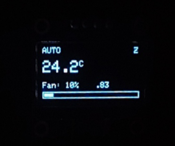
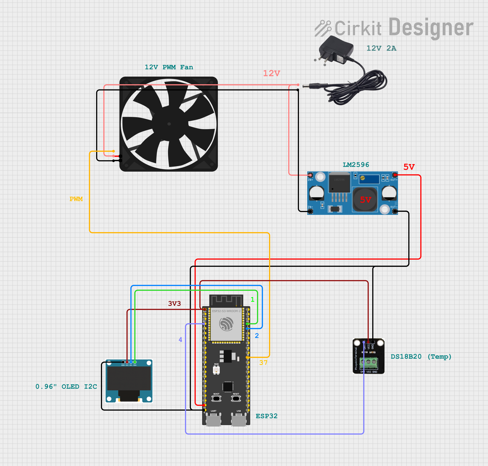
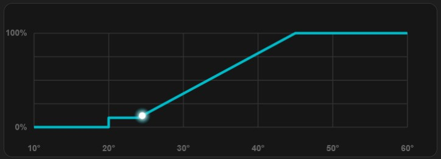
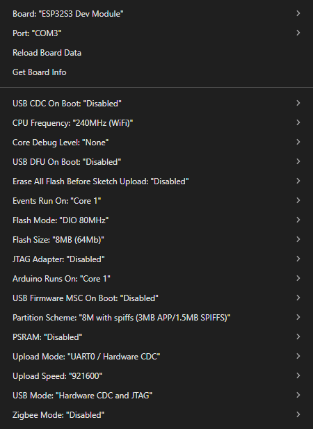
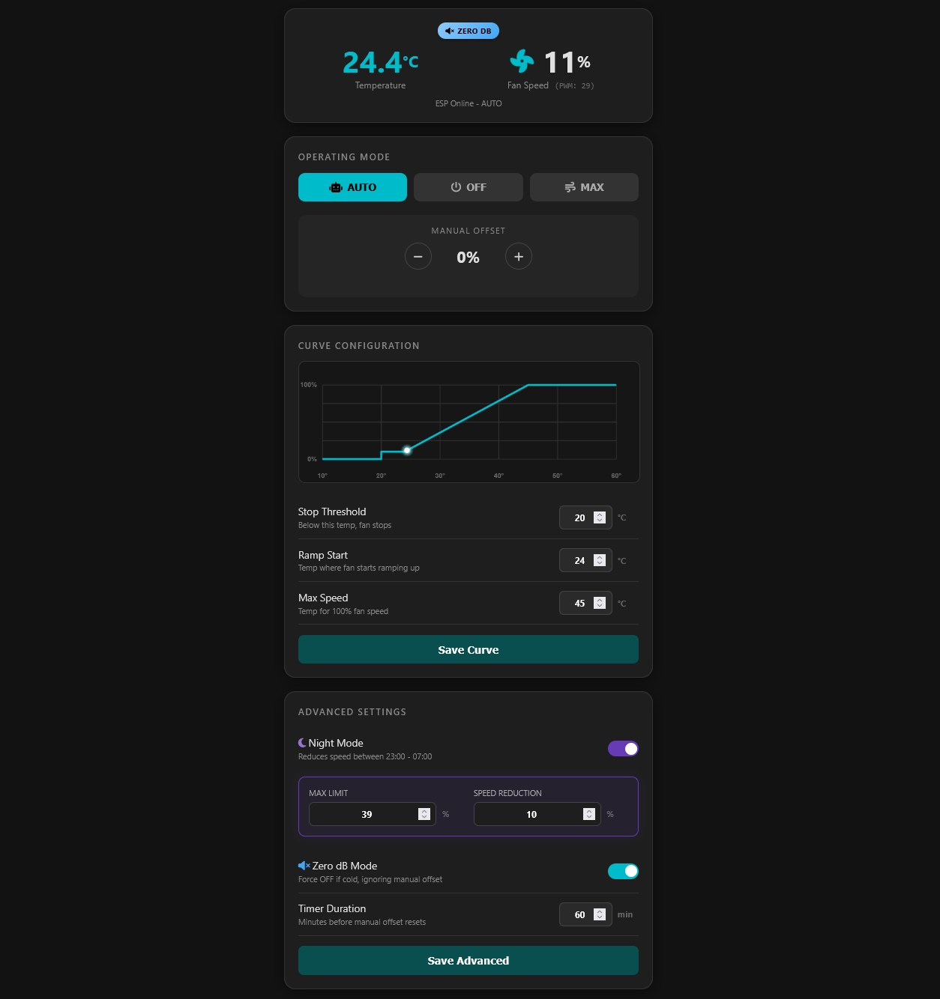

<p align='center'>
   
</p>

# RackController v3.0: Smart Cooling System (ESP32)

A DIY professional-grade cooling system for home server racks or network cabinets, built with an ESP32-S3, Arctic PWM fans, and a DS18B20 temperature sensor.

✨ **Version 3.0** ✨ introduces a fully decoupled architecture: the ESP32 acts as a pure JSON REST backend, while the web dashboard is a standalone static frontend served by an nginx container — proxied via Nginx Proxy Manager — with no HTML embedded in the microcontroller code.

## 🏗️ Architecture
```
Browser
  │
  ▼
Nginx Proxy Manager (reverse proxy)
  │
  ├──▶  nginx container  (Alpine + nginx, serves index.html & assets)
  │         └── /api/*  ──▶  ESP32 WebServer  (JSON API on port 80)
  └──▶  ESP32  (fallback direct access, same API)
```
The frontend (`index.html`) is completely independent of the firmware. It fetches data from `/api/json` and posts commands to `/api/update`, routing through the reverse proxy to the ESP32's local IP. This means you can update the interface without touching the microcontroller, and you can host the dashboard on any machine on the same network.

## 🚀 Features

### Core
- **♨️ Automatic Temp Control:** Linear PWM ramp based on configurable temperature thresholds.
- **🤫 Zero dB Mode:** Fans completely stop when temperature is below the off-threshold.
- **🌙 Night Mode:** Automatically limits fan speed (configurable cap and offset) between 23:00 and 07:00, unless a critical temperature is reached.
- **⚡ Anti-Stall Logic:** A minimum kickstart PWM (~10%) ensures fans always start reliably without stalling at low RPM.
- **❌ Offline Mode:** Works autonomously without a Wi-Fi connection; reverts to AP setup mode if credentials are missing or wrong.

### Web Interface (Dark Mode)
- **📊 Dashboard:** Real-time temperature and fan speed with dynamic Font Awesome icons, updated every 2 seconds via AJAX.
- **🛠 Manual Controls:** Speed offset (+/- 5%), configurable override timer, and master modes (AUTO, MAX, OFF).
- **📈 Live Curve Preview:** Interactive chart that updates instantly as you tweak thresholds — no need to save first.
- **⚙️ Advanced Settings:** Night Mode toggle with configurable max PWM and offset; Zero dB mode toggle.
- **🛜 WiFi Setup:** Change SSID and password from the browser; the ESP32 reboots and reconnects automatically.

### Backend (ESP32 Firmware)
- **💾 Persistent Storage:** All settings (temperature thresholds, night mode config, WiFi credentials) are stored in ESP32 Flash via `Preferences`. Survives reboots and power outages.
- **🔄 CORS-enabled REST API:** Clean separation from the frontend; all endpoints return JSON or plain text.
- **📶 AP Fallback:** If Wi-Fi fails, the ESP32 creates a `Rack-Setup` access point for first-time credential entry.
- **🔁 Auto-Reconnect:** Periodically attempts to reconnect if the Wi-Fi connection drops.

### OLED Display
- Live mode indicator (AUTO / MAN+% / MAX / OFF).
- Large temperature readout and fan percentage with progress bar.
- Last IP octet shown in the footer for quick browser access.
- Night indicator (`N`) and Zero dB indicator (`Z`) icons.
- **Auto-Dim:** Contrast is reduced automatically during Night Mode to prevent burn-in.
<p align='center'>
   
   <br/>
   <i>Display Example</i>
</p>

## 🛠 Hardware Required

| Component | What I Used |
| :--- | :--- |
| **Microcontroller** | ESP32-S3 N8R2 (any ESP32 works) |
| **Fans** | Arctic P14 PRO PWM PST (or P12) (any standard 4-pin PWM is ok) |
| **Temp Sensor** | DS18B20 |
| **Power** | 12V 2A PSU + LM2596 step-down (12V → 5V for ESP32) |
| **Display** | 0.96" OLED I2C (SSD1306) |
| **Misc** | Wago-style connectors, 20AWG silicone wire, DC jack adapter, PWM extensions |

> _Note: For fans at least one for intake and one for exhaust (possibly daisy-chained)._

## 🔌 Wiring

| Component | ESP32 Pin | Note |
| :--- | :--- | :--- |
| **Fan PWM** | GPIO 37 | Blue wire of the fan |
| **DS18B20 Data** | GPIO 4 | Requires 4.7k Pull-up resistor (often built-in on modules) |
| **OLED SDA** | GPIO 1 | I2C Data |
| **OLED SCL** | GPIO 2 | I2C Clock |

> *Note: Fans must be powered directly by the 12V PSU. The ESP32 and OLED are powered by 5V (from LM2596). Only grounds (GND) must be shared.*

> *Note: almost all GPIO pins are equivalent.*

<p align='center'>
   
   <br/>
   <i>Circuit Scheme</i>
</p>

## ❄️ Cooling Logic

The system follows a 3-stage automatic logic to balance silence and performance:

<p align='center'>
   
   <br/>
   <i>Graph Example (20°C-24°C-45°C)</i>
</p>

The system uses a 3-stage automatic profile:
1. **🚫 OFF Zone**: Below the `tOff` threshold, fans are completely stopped (0% PWM).
2. **▶️ Startup Zone**: Between `tOff` and `tRamp`, fans run at a fixed **Minimum Startup PWM** (~10%). This ensures the fan has enough torque to spin reliably.
3. **📈Ramp Zone**: Between `tRamp` and `tMax`, the speed increases linearly from the minimum value to 100%.

**🌙 Night Mode** subtracts a configurable offset from the calculated PWM and caps the result at a configurable maximum, ensuring silence between 23:00 and 07:00.

## 🌐 API Reference - ESP32 Backend

All endpoints are accessible at `http://<ESP32_IP>` directly, or through the reverse proxy at `/api/`.

| Endpoint | Method | Description |
| :--- | :--- | :--- |
| `/json` | GET | Returns full system state and configuration as JSON |
| `/update` | GET | Accepts query parameters to change mode, offset, and settings |
| `/set_wifi` | POST | Saves new SSID/password and reboots |
| `/` | GET | Minimal status page (or AP setup form in config mode) |

### `/json` Response Example
```json
{
  "temp": 38.5,
  "pwm": 80,
  "pct": 31,
  "mode": "AUTO",
  "offset": 0,
  "rem": 0,
  "isNight": false,
  "conf": {
    "tOff": 30.0,
    "tRamp": 40.0,
    "tMax": 55.0,
    "dur": 60,
    "nEn": false,
    "nMax": 100,
    "nOff": 25,
    "zEn": false
  }
}
```

### `/update` Parameters

| Parameter | Type | Description |
| :--- | :--- | :--- |
| `m` | string | Set mode: `AUTO`, `MAX`, `OFF` |
| `add` | flag | Increase speed offset by 5% |
| `sub` | flag | Decrease speed offset by 5% |
| `reset` | flag | Reset offset and timer |
| `tOff` | float | Off-threshold temperature (°C) |
| `tRamp` | float | Ramp start temperature (°C) |
| `tMax` | float | Full speed temperature (°C) |
| `dur` | int | Override timer duration (minutes) |
| `nEn` | 0/1 | Enable/disable Night Mode |
| `nMax` | int | Night Mode PWM cap (0–255) |
| `nOff` | int | Night Mode PWM offset reduction |
| `zEn` | 0/1 | Enable/disable Zero dB Mode |


## 🐳 Docker Setup (Frontend)

The web interface is served by a lightweight Alpine + nginx container. Nginx Proxy Manager handles routing and optional SSL.

### Directory Structure
```
/
├── etc/nginx/http.d/default.conf
└── var/www/html/rack/
    ├── index.html
    └── assets/
        └── fan-solid-full.svg
```

Create a container with alpine, then:

```
apk update
apk add nginx
mkdir -p /var/www/html/rack
chown -R nginx:nginx /var/www/html
nano /etc/nginx/http.d/default.conf
```

### `nginx.conf`
```nginx
server {
    listen 80 default_server;
    root /var/www/html;
    index index.html;

    # Serves static files (the  frontend dashboard)
    location / {
        try_files $uri $uri/ =404;
    }

    # Forward /api/... request to ESP32
    location /api/ {
        rewrite ^/api/(.*) /$1 break;

        # Forward to ESP32's IP (INSERT HERE YOUR ESP32 IP!)
        proxy_pass http://192.168.1.83;

        proxy_set_header Host $host;
        proxy_set_header X-Real-IP $remote_addr;
    }
}
```

> Replace `<ESP32_LOCAL_IP>` with your ESP32's static IP (e.g., `192.168.1.83`). It's recommended to assign a DHCP reservation for the ESP32 in your router.

Apply modifications:
```
service nginx restart
rc-update add nginx default
```

Then, in Nginx Proxy Manager, add a Proxy Host pointing to `<alpine-frontend>:80` (or the host IP on port 8080), and optionally enable Let's Encrypt SSL.


## 📦 Firmware Installation

1.  **Install Arduino IDE** (Legacy 1.8.x or 2.0+, this could give throubles while downloading libraries).
2.  Install the **ESP32 Board Manager** by Espressif.
3.  Install required libraries via Library Manager:
    *   `Adafruit SSD1306`
    *   `Adafruit GFX`
    *   `DallasTemperature`
    *   `OneWire`
4.  Open the `.ino` file.
5.  *(Optional)* Edit lines with your default Wi-Fi credentials:
    ```cpp
    String s = prefs.getString("ssid", "WiFi-Name"); // change with your wifi name (or use AP mode)
    String p = prefs.getString("pass", "WiFi-Pass"); // change with your wifi password (or use AP mode)
    ```
    > _Note: Credentials can also be set at runtime via the web interface or AP setup page._

    > *Note: Change also pin numbers if you used different ones.*
6.  Select your board (e.g., `ESP32S3 Dev Module`) and Flash it.
    <p align='center'>
       
       <br/>
       <i>Arduino IDE configuration for ESP32-S3 N8R2</i>
   </p>
   > *Note:* Use the right COM port.

## 📱 Usage

<p align='center'>
   
   <br/>
   <i>Web Interface</i>
</p>

1. Power on the ESP32. The OLED shows the connecting status and, once online, the last octet of its IP (e.g., `.83`).
2. Start the container (docker or proxmox).
3. Open the Nginx Proxy Manager host (or `http://<host-ip>:8080`) in your browser.
4. Use the dashboard:
   - **Speed buttons** — add or remove percentage relative to the auto curve.
   - **Timer** — set how long the manual offset stays active before reverting to AUTO.
   - **Master controls** — force MAX speed or cut power to all fans.
   - **Curve Config** — drag sliders to tune thresholds; the chart updates live.
   - **WiFi Setup** — change network credentials without reflashing.

If the ESP32 can't connect to Wi-Fi, it creates an access point named `Rack-Setup` (password: `12345678`). Connect to it and navigate to `192.168.4.1` to enter your credentials.


## 📜 License

This project is open-source. Feel free to modify and distribute.
